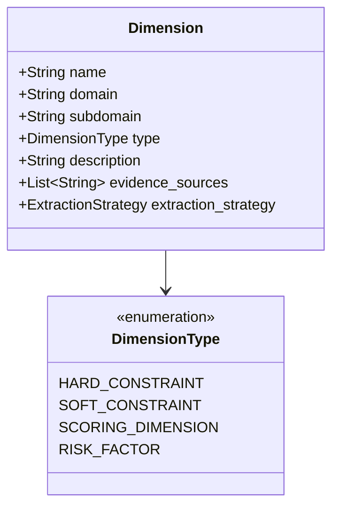
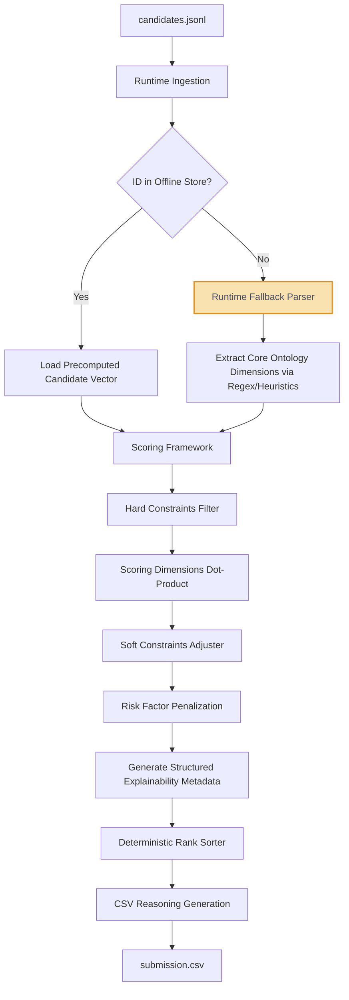

# TalentPrism Architecture Blueprint — Version 2

This document describes the Version 2 architecture for the TalentPrism candidate discovery and ranking system. It transitions the system from a heuristic, embedding-heavy model to a generalized, ontology-driven platform where both Candidates and Job Descriptions (JDs) are represented as structured, interpretable vectors within a shared dimension space.

---

## 1. System Vision

TalentPrism is a scalable, enterprise-grade recruiting intelligence system designed to match candidate profiles to job descriptions. It bridges the gap between what a candidate writes and what they actually did, and between what a recruiter asks for and what they actually mean. 

The core vision is to build an **interpretable, generalized matching engine** that projects raw, messy talent profiles and complex job descriptions into a unified **Master Dimension Space**. By decoupling feature extraction from ranking, TalentPrism runs complex matching logic in milliseconds on standard CPU hardware, ensuring complete predictability, lack of hallucinations, and transparency.

---

## 2. Architectural Principles

1. **Interpretability over Black-Boxes**: All candidate and JD representations must be human-understandable vectors rather than raw, opaque high-dimensional embeddings. Embeddings are used purely as a technical tool during extraction.
2. **Unified Dimension Space**: Both candidates and job descriptions are projected onto the same Master Dimension Ontology. Matching is a distance metric/comparison between these two vectors.
3. **Decoupled Extraction and Ranking**: Feature extraction (heavy, LLM/deep learning-based, slower) is executed offline during profile ingestion or job creation. The runtime ranking engine (lightweight, mathematical) only processes precomputed vectors.
4. **First-Class Explainability**: Every scoring step must generate structured explanation metadata (positive factors, negative factors, risks, and violations). The final user-facing text is a downstream rendering of this structured metadata.
5. **No Hardcoded JDs**: The system must support arbitrary job descriptions by dynamically aligning candidate profiles to any JD represented under the master ontology.

---

## 3. Dimension Ontology Design

The foundation of the entire platform is the **Master Dimension Ontology**. This ontology defines every attribute that the system can measure or match.



### Ontology Schema & Dimensions Example

| Dimension Name | Domain | Subdomain | Type | Evidence Sources | Extraction Strategy |
| :--- | :--- | :--- | :--- | :--- | :--- |
| **ProductCompanyExp** | Work History | Company Type | Scoring | `career_history.company`, `career_history.description`, `profile.current_industry` | Semantic classification of company descriptions & name cross-referencing against product databases. |
| **NoConsultingOnly** | Work History | Company Type | Hard | `career_history.company` | Regex and lookup tables checking if *all* employers are in the services registry. |
| **ActiveDeveloper** | Experience | Hands-on Coding | Hard | `career_history.description`, `redrob_signals.github_activity_score` | Text classification of titles and descriptions (e.g. tech lead without coding) and GitHub activity verification. |
| **VectorSearchExp** | Skills | ML Engineering | Scoring | `skills.name`, `career_history.description` | Embedding-based keyword mapping (Pinecone, FAISS, Milvus) and career history description analysis. |
| **LocationMatch** | Demographics | Geographics | Soft | `profile.location`, `profile.willing_to_relocate` | Geocoding distance calculation against target locations. |
| **HoneypotFlag** | Integrity | Profile Validity | Risk | `skills`, `career_history`, `education` | Anomaly detection checks (e.g., skill duration > total experience, date overlaps). |
| **JobHopping** | Retention | Career Stability | Risk | `career_history.start_date`, `career_history.end_date` | Date math calculating the average tenure per company over the past 5 years. |

---

## 4. Candidate Representation Design

Instead of storing raw text or high-dimensional embeddings as the primary representation, the system extracts an interpretable **Candidate Dimension Vector**.

```json
{
  "candidate_id": "CAND_0042871",
  "dimensions": {
    "product_company_experience": 0.85,
    "active_hands_on_coding": 1.0,
    "vector_search_experience": 0.90,
    "python_proficiency": 0.80,
    "evaluation_framework_design": 0.75,
    "location_proximity": 1.0,
    "notice_period_days": 15,
    "willing_to_relocate": true,
    "job_hopping_index": 0.15,
    "academic_only_experience": 0.0,
    "consulting_only_experience": 0.0,
    "profile_timeline_consistency": 1.0
  },
  "metadata": {
    "current_title": "Senior AI Engineer",
    "years_of_experience": 7.2,
    "top_skills": ["FAISS", "SentenceTransformers", "Python"],
    "notice_period_days": 15
  }
}
```

---

## 5. JD Representation Design

A Job Description is processed offline into a structured **JD Vector** representing the recruiter's requirements and weights across the same ontology dimensions.

```json
{
  "jd_id": "JD_SR_AI_FOUNDING",
  "hard_constraints": {
    "active_hands_on_coding": 1.0,
    "academic_only_experience": 0.0,
    "consulting_only_experience": 0.0,
    "profile_timeline_consistency": 1.0
  },
  "soft_constraints": {
    "location_proximity": { "target": "Pune/Noida/Delhi NCR/Hyderabad/Mumbai", "weight": 0.15 },
    "notice_period_days": { "target": "<= 30 days", "weight": 0.10 }
  },
  "scoring_dimensions": {
    "vector_search_experience": 0.35,
    "product_company_experience": 0.25,
    "python_proficiency": 0.20,
    "evaluation_framework_design": 0.20
  },
  "risk_factors": {
    "job_hopping_index": { "max_allowed": 0.40, "penalty_multiplier": 0.5 },
    "honeypot_flag": { "max_allowed": 0.0, "penalty_multiplier": 0.0 }
  }
}
```

---

## 6. Offline Precomputation Pipeline

Both candidate profiles and job descriptions are precomputed before they enter the runtime ranking engine.

```
[Candidate JSONL] --> [Candidate Parser] --> [Extractor Layer] --> [Candidate Dimension Store]
                                                   ^
                                                   | (Uses local models / embeddings)
                                                   v
[JD Document]     --> [JD Parser]        --> [Extractor Layer] --> [JD Dimension Store]
```

### Offline Execution Steps:
1. **Candidate Parsing**: When candidates sync, the *Candidate Parser* extracts raw text and signals.
2. **Dimension Extraction**: Heavy models (SentenceTransformers, Named Entity Recognition, classification networks) run on CPU/GPU to extract scores for each dimension in the Ontology.
3. **JD Parsing**: When a recruiter uploads a JD, the *JD Parser* extracts explicit text and maps it to the target weights and constraints.
4. **Artifact Storage**: The resulting structured Candidate Vectors and JD Vectors are stored in a fast serialized lookup store (e.g. JSON, Protocol Buffers, or Parquet files).

---

## 7. Runtime Ranking Pipeline

The runtime pipeline is designed for high speed and predictable CPU execution. It is completely offline and handles new candidates via a fast fallback parser.



---

## 8. Scoring Framework

Scoring is computed in a four-stage cascading pipeline to prevent mixing soft weights with absolute disqualifiers.

### Stage 1: Hard Constraints ($H_c$)
Hard constraints are binary filters. If any hard constraint fails, the feasibility multiplier drops to $0.0$, pushing the candidate to the bottom of the list.

$$H_c = \prod_{i \in \text{Hard}} \mathbb{I}(\text{candidate\_dim}_i \text{ matches } \text{jd\_constraint}_i)$$

*Example*: If `consulting_only_experience` is 1.0 (indicating the candidate has *only* worked at Wipro/TCS/etc. without product experience) and the JD hard constraint is 0.0, $H_c = 0.0$.

### Stage 2: Scoring Dimensions ($S_{core}$)
We compute the dot product of the candidate's core skills and experience vectors against the JD's weights:

$$S_{core} = \sum_{j \in \text{Scoring}} \text{candidate\_dim}_j \times \text{jd\_weight}_j$$

### Stage 3: Soft Constraints ($S_{soft}$)
Soft constraints add or subtract fractional bonuses based on preferences like location or notice period.

$$S_{soft} = \sum_{k \in \text{Soft}} \text{bonus\_calculator}(\text{candidate\_dim}_k, \text{jd\_soft\_target}_k) \times \text{jd\_weight}_k$$

### Stage 4: Risk Factors ($R_{penalty}$)
Risk factors act as multiplicative penalties (modifiers) on the combined score. This ensures that high risk degrades the score organically rather than acting as a binary filter.

$$R_{penalty} = \prod_{l \in \text{Risk}} (1 - \text{candidate\_dim}_l \times \text{jd\_penalty}_l)$$

### Final Score Formula
$$\text{Final Score} = H_c \times (S_{core} + S_{soft}) \times R_{penalty}$$

---

## 9. Explainability Framework

Explainability is a core component of the scoring model. During scoring, the system builds an intermediate structured object containing the factors that influenced the score:

```json
{
  "candidate_id": "CAND_0042871",
  "score": 0.892,
  "explainability": {
    "positive_factors": ["vector_search_experience", "product_company_experience"],
    "negative_factors": ["notice_period_days"],
    "constraint_violations": [],
    "risk_factors": []
  }
}
```

### Decoupled Reasoning Generator
A separate formatting module converts this structured metadata into the final string. This ensures the ranking logic and the narrative logic are decoupled.

```python
def generate_reasoning_string(exp_metadata, candidate_metadata):
    # Rule engine translates positive_factors and risks to natural language
    sentences = []
    if "vector_search_experience" in exp_metadata["positive_factors"]:
        sentences.append(f"Strong match for vector search systems, with hands-on experience in {', '.join(candidate_metadata['top_skills'])}.")
    
    if "product_company_experience" in exp_metadata["positive_factors"]:
        sentences.append("Demonstrates product-company background matching the startup requirements.")
        
    if "notice_period_days" in exp_metadata["negative_factors"]:
        sentences.append(f"Note: Candidate has a {candidate_metadata['notice_period_days']}-day notice period.")
        
    return " ".join(sentences)
```

*This guarantees*:
*   **No Hallucinations**: Only facts present in the candidate's metadata and scored dimensions are rendered.
*   **High Variation**: Output changes organically based on which dimensions triggered the positive/negative flags.
*   **Rank Consistency**: The tone is mathematically linked to the score (e.g., if a candidate has a constraint violation, it is reported; if they are top-ranked, the positive factors are emphasized).

---

## 10. Risks & Tradeoffs

1. **Unknown Candidates at Runtime**:
   * *Risk*: Sandboxed runtime environment evaluates new profiles not present in the offline precomputed store.
   * *Tradeoff/Mitigation*: We implement a runtime fallback parser. It uses fast, CPU-bound string tokenizers and regex rules to extract basic ontology scores. The runtime fallback is less nuanced but guarantees that new candidates are ranked accurately without exceeding the 5-minute limit.
2. **Ontology Coverage Boundaries**:
   * *Risk*: An ontology might miss niche skills or unique descriptions in future job descriptions.
   * *Tradeoff/Mitigation*: We include a catch-all "NicheSpecialtyMatch" dimension, which computes the cosine similarity between the candidate's aggregate text embedding and the JD text embedding. This preserves semantic coverage for dimensions not explicitly defined in the ontology.
3. **Rigid Penalties for Non-Traditional Profiles**:
   * *Risk*: High-quality candidates who had a short career stint or gaps might be penalized as "job-hoppers" or "unstable."
   * *Tradeoff/Mitigation*: Penalties are capped and modeled multiplicatively rather than as hard filters, allowing outstanding skill matches to overcome moderate risk flags.

---

## 11. Future Product Evolution

As TalentPrism scales from a hackathon ranker to a production enterprise platform:
1. **Dynamic Ontology Learning**: Graph neural networks can expand the ontology automatically by analyzing historical career paths and skill adjacencies across millions of profiles.
2. **Active Feedback Loop Integration**: When recruiters save or reject profiles, the weights of the JD vector can be adjusted in real-time using online gradient descent (Learning-to-Rank updates).
3. **Automated Assessment Alignment**: Candidate skill proficiency can be verified by cross-referencing their Redrob platform skill assessment scores directly against target JD ontology dimensions.
