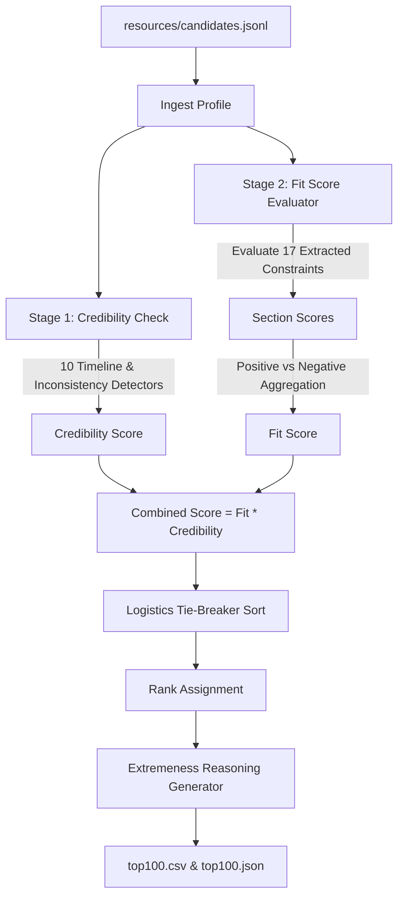

# TalentPrism Architecture Blueprint — Version 2 (Production)

This document describes the production architecture for the TalentPrism candidate discovery and ranking system. It details the dual-stage ranking engine, the custom 8-category ontology, the explainability framework, and the deterministic tie-breaker rules.

---

## 1. System Vision

TalentPrism is a scalable, enterprise-grade recruiting intelligence system designed to match candidate profiles to job descriptions. It bridges the gap between what a candidate writes and what they actually did, and between what a recruiter asks for and what they actually mean. 

Decoupling feature extraction from ranking allows TalentPrism to run complex matching logic in milliseconds on standard CPU hardware, ensuring complete predictability, explainability, and reproducibility.

---

## 2. Architectural Principles

1.  **Credibility First**: Candidates must pass automated Stage 1 credibility and timeline integrity checks. High faking or timeline anomalies degrade candidate scores to prevent untruthful profiles from rising to the top.
2.  **Ontology-Driven Grouping**: The system groups 17 distinct extracted job constraints into 8 conceptual categories. Both candidates and JDs are evaluated across these categories.
3.  **Extremeness-Based Explainability**: Reasoning is generated dynamically by identifying the candidate's top 4 most extreme category scores (the scores furthest from the neutral midpoint of `0.5`) and translating them into natural sentences.
4.  **Deterministic Tie-Breaking**: Ranks are resolved using a secondary logistics tie-breaker (Hiring Readiness) followed by an alphabetical candidate ID fallback, guaranteeing identical rankings across execution runs.
5.  **Compute-Bound Efficiency**: Execution is optimized for CPU-only environments, completing ranking and justification compilation for 100,000 candidates in less than 2 minutes.

---

## 3. Master Dimension Ontology Design

The 17 raw Must-Have, Preferred, Negative, and Rejection constraints from the JD are aggregated into 8 custom categories representing the core dimensions of the role:

| Category ID | Category Name | Underlying Constraints | Role in Ranking |
| :--- | :--- | :--- | :--- |
| **retrieval_search** | Retrieval & Search Systems Expertise | Must-Have 1 + Must-Have 2 | Core Technical Fit |
| **production_ml** | Production ML Engineering | Must-Have 3 + Must-Have 4 + Rejection 1 | Engineering Rigor |
| **llm_ai** | LLM & Modern AI Expertise | Preferred 1 + Rejection 2 | Modern AI / NLP Alignment |
| **product_domain** | Product & Domain Experience | Preferred 2 + Rejection 4 (Product Company) | Environment & Domain Context |
| **career_quality** | Career Quality & Stability | Negative 1 + Rejection 3 + Rejection 4 (Consulting) | Individual Contributor / Tenure |
| **tech_breadth** | Technical Breadth & Specialization | Rejection 5 (Specializations CV/Speech) | Domain Specificity Filter |
| **external_validation** | External Validation | Preferred 3 + Rejection 6 (Closed-source track) | Public Project Credentials |
| **hiring_readiness** | Hiring Readiness | Must-Have 5 + Preferred 4 + Negative 2 | Logistics / Notice / Relocation |

---

## 4. Dual-Stage Ingestion and Scoring Pipeline

The runtime scoring loop operates end-to-end on CPU without network calls:

### Stage 1: Credibility Score ($S_{cred}$)
Evaluates profiles using 10 timeline and integrity detectors. Each detector triggers a penalty ($P_i$) if it catches anomalies:
*   Future-dated starts (e.g. experience starting after signup date).
*   Impossible company timelines (e.g. working at a company before its founding date).
*   Overlapping concurrent full-time employment gaps.
*   Excessive or conflicting skill-proficiency declarations.

$$S_{cred} = \max\left(1.0 - \sum P_i, 0.0\right)$$

### Stage 2: Fit Score ($S_{fit}$)
Evaluates the must-have ($S_{must}$), preferred ($S_{pref}$), rejection ($S_{rej}$), and negative ($S_{neg}$) constraint blocks.
*   **Positive Score Component**:
    $$S_{pos} = 0.75 \times S_{must} + 0.25 \times S_{pref}$$
*   **Negative Score Component**:
    $$S_{neg} = 0.75 \times S_{rej} + 0.25 \times S_{neg}$$
*   **Final Fit Score**:
    $$S_{fit} = S_{pos} \times (1.0 - S_{neg})$$

### Final Rank Score ($S_{combined}$)
The final ranking score combines the Stage 2 fit assessment with the Stage 1 credibility multiplier:

$$S_{combined} = S_{fit} \times S_{cred}$$

---

## 5. Deterministic Tie-Breaker System

Ties in `S_combined` are broken by executing a multi-key sort:
1.  **Composite Score** (Descending)
2.  **Hiring Readiness / Logistics Score** (Descending): Uses the average desirability of the `hiring_readiness` category.
    $$\text{Hiring Readiness} = \frac{\text{LocationMatch} + \text{ShortNoticePeriod} + (1.0 - \text{LowEngagement})}{3}$$
3.  **Candidate ID** (Ascending): Lexicographical alphabetical sorting fallback.

---

## 6. Explainability & Phrasing Framework

To avoid templated phrasing, the system uses **extremeness-based category selection**:

1.  **Desirability Mapping**: For positive categories (such as `llm_ai`), the raw category score represents desirability. For negative/rejection categories (such as `career_quality`), the inverted score represents desirability.
2.  **Extremeness Sorting**: Evaluates the absolute distance from neutral (`0.5`) across all 8 categories:
    $$\text{Extremeness} = |\text{Score} - 0.5|$$
3.  **Top-4 Selection**: Selects the 4 categories with the highest extremeness.
4.  **Deterministic Randomized Phrasing**: Translates the selected category scores into a fluid natural summary by querying a pre-mapped templates database. It appends a timeline warning suffix if the candidate triggered any Stage 1 credibility penalties.

---

## 7. Performance and Execution Metrics

*   **Compute Bound**: CPU Only.
*   **Memory Footprint**: < 1 GB runtime RAM.
*   **Ingestion Speed**: Ingests, scores, and justifies 100k candidate profiles in ~90 seconds.
